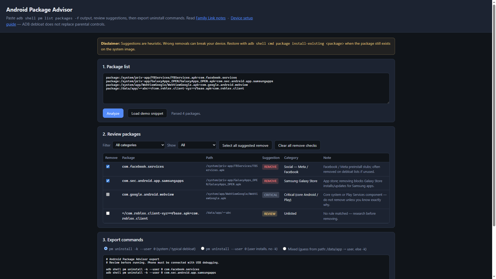

# Android Package Advisor

Remove bloatware from Android phones — safely, with suggestions you review before anything runs.



---

## Use it now

**[Open Android Package Advisor](https://cyberresearch-us.github.io/android-debloat-advisor/)**

No install, no account. Works in any browser.

---

## How it works

You need a computer, a USB cable, and 10 minutes.

| Step | What you do |
|------|-------------|
| **1. Prepare the phone** | Turn on Developer Options and USB debugging in Settings. |
| **2. Install ADB on your computer** | Download [Android Platform Tools](https://developer.android.com/studio/releases/platform-tools) (small ZIP, no Android Studio needed). |
| **3. Export the package list** | Connect the phone via USB and run one command to copy all installed packages to your clipboard. |
| **4. Paste into the advisor** | Open the [tool](https://cyberresearch-us.github.io/android-debloat-advisor/), paste, click **Analyze**. |
| **5. Review suggestions** | Every package gets a label: **Remove**, **Keep**, or **Review**. Adjust the checkboxes to match what you want. |
| **6. Copy and run** | Click **Copy to clipboard**, paste the commands back into your terminal. Done. |

**Never done this before?** The **[full device setup guide](https://cyberresearch-us.github.io/android-debloat-advisor/device-setup.html)** walks through every step — from tapping Build Number 7 times to running your first command.

**Want an AI to do it for you?** If you use Cursor, Windsurf, Claude Code, or any AI coding tool with terminal access, paste our **[ready-made prompt](https://cyberresearch-us.github.io/android-debloat-advisor/ai-prompt.html)** and let the AI handle the technical steps. You just review and approve.

---

## Is this safe?

The commands use `pm uninstall -k --user 0`, which **disables** the app for your user profile. The actual APK stays on the phone's system image. If something breaks, restore it immediately:

```
adb shell cmd package install-existing com.example.package
```

The advisor marks critical packages (dialer, home screen, Play Services, etc.) as **Keep** and blocks the checkbox so you cannot accidentally remove them.

---

## Parental controls

Removing apps is a good start, but it does **not** block the internet or prevent new installs. Pair this tool with **Google Family Link** for app approval, web filtering, and screen time.

**[Family Link setup guide and checklist](https://cyberresearch-us.github.io/android-debloat-advisor/family-link.html)**

---
---

## For developers

Everything below is for people who want to fork, self-host, or contribute.

---

### Host your own copy (optional)

The tool is plain HTML/CSS/JS under `docs/` — no build step, no backend.

1. [Fork this repo](https://github.com/cyberresearch-us/android-debloat-advisor/fork) or [create a new one](https://github.com/new) and push:
   ```bash
   git clone https://github.com/cyberresearch-us/android-debloat-advisor.git
   cd android-debloat-advisor
   git remote set-url origin https://github.com/<you>/<your-repo>.git
   git push -u origin main
   ```
2. On GitHub: **Settings → Pages → Source**: branch **main**, folder **`/docs`** → **Save**.
3. Your site is live at `https://<you>.github.io/<your-repo>/` in about 60 seconds.

### Contributing rules

Rules live in `data/rules.json`. After editing, sync the copy used by GitHub Pages:

```powershell
.\scripts\sync-rules.ps1
```

See [CONTRIBUTING.md](CONTRIBUTING.md) for details on adding packages, prefixes, and categories.

### Security and CI

GitHub Actions (`.github/workflows/ci.yml`) runs on every push and PR:

| Check | Tool |
|-------|------|
| Rules files in sync | `cmp` |
| Filesystem scan | [Trivy v0.35](https://github.com/aquasecurity/trivy-action) |
| Secret detection | [Gitleaks v2](https://github.com/gitleaks/gitleaks-action) |

See [SECURITY.md](SECURITY.md) for the threat model and local scan instructions.

### Project layout

```
android-debloat-advisor/
├── docs/                        ← GitHub Pages root
│   ├── index.html               Interactive advisor
│   ├── device-setup.html        Full phone + ADB setup guide
│   ├── family-link.html         Parental controls notes
│   └── data/rules.json          Suggestion rules (keep in sync)
├── data/rules.json              Edit rules here
├── scripts/
│   ├── export-packages.ps1      Windows clipboard export
│   ├── export-packages.sh       macOS / Linux clipboard export
│   ├── sync-rules.ps1           Sync rules → docs/data/
│   └── test-rules.mjs           Offline rule test against a package dump
├── .github/workflows/ci.yml     Rules sync + Trivy + Gitleaks
├── CONTRIBUTING.md
├── SECURITY.md
└── LICENSE                      MIT
```

---

## License

MIT — [LICENSE](LICENSE)
